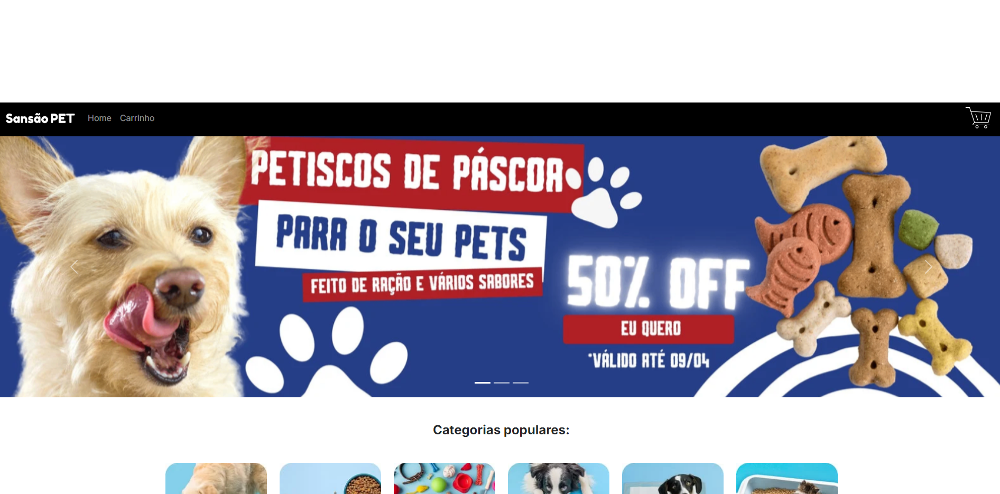
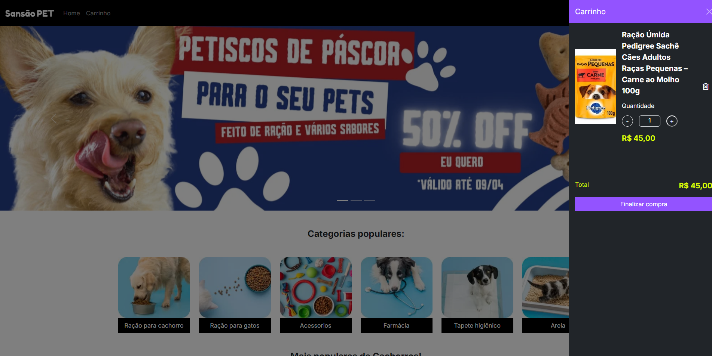
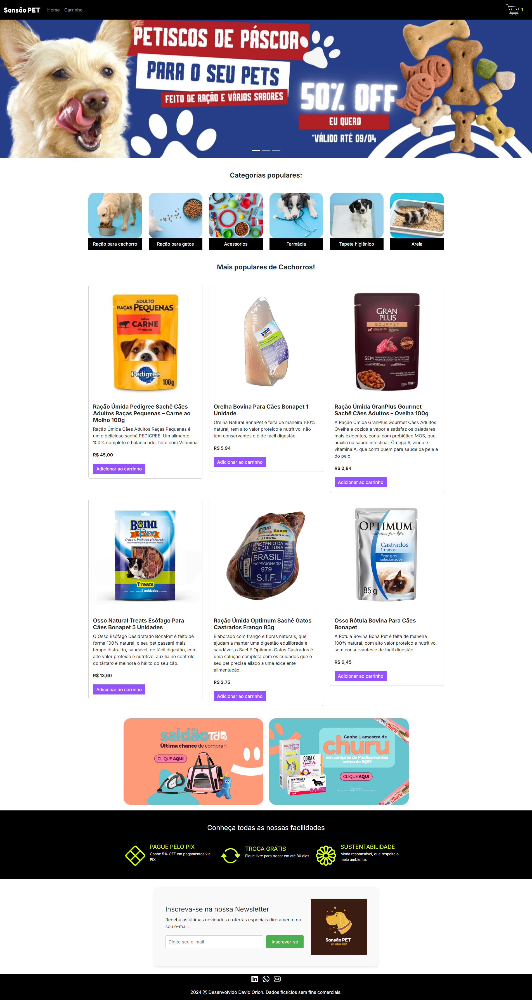
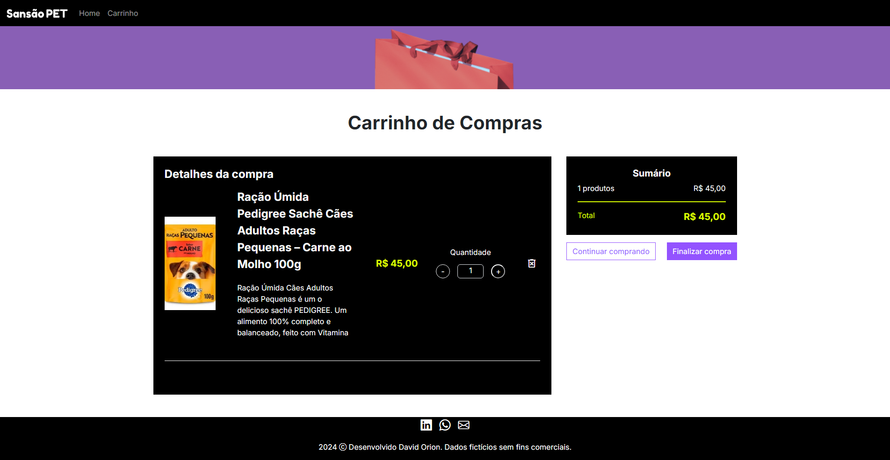

<h1 align="center">
<br>
  
<br>
<br>
Sansão PET
</h1>

<p align="center">
Sansão PET e modelo de E-commerc em PET SHOP, com produtos e acessorios e . E Loja Não REal onde foi usada pratica de tecnologia REACT com bilioteca. Diferencie o Vite do CRA e conheça as vantagens do uso do Styled Components
Utilize styled-components para criação de uma NavBar e estilização de um banner
Projete e implemente componentes React para exibir imagens e legendas
Aplique estilos personalizados e acessíveis para uma galeria de fotos
Adicione uma barra lateral de imagens populares e footer</p>

<p align="center">
  <a href="#">
    
  </a>
</p>

<div align="center">

### Apresentação

<br>

### Home


  <br>

  <br>

  ### Pagina inteira

  <br>

   ### Carinho de compra

  <br>
  
  <br> 

</div>

 ### Hospedagem 
```sh
 vercel

 https://petshopsansao.vercel.app/

```
 ### Objetivos
```sh
 Sansão PET e modelo de E-commerc em PET SHOP, com produtos e acessorios e . E Loja Não REAL onde foi usada pratica de tecnologia REACT com bilioteca.

```


<hr />

## Tecnologia usada

```sh
 o Vite do CRA e conheça as vantagens do uso do Styled Components
Utilize styled-components para criação de uma NavBar e estilização de um banner
Projete e implemente componentes React para exibir imagens e legendas
Aplique estilos personalizados e acessíveis para uma galeria de fotos
Adicione uma barra lateral de imagens populares e footer 
 
```

Usado do php puro, no servidor linux 

- ⚛️ **Javascript** — json
- ⚛️ **React** — 
de usuario
- 💹 **JQuery** — Animações


## Modelos


1. Modelo apenas ilustratorio<br />


